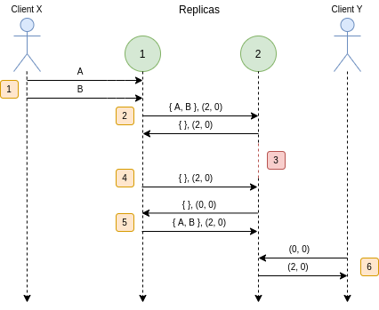

# Relatório do projeto Sauron

Sistemas Distribuídos 2019-2020, segundo semestre

## Autores

**Grupo T19**

| Número | Nome              | Utilizador                                    | Correio eletrónico                                                                      |
| ------ | ----------------- | --------------------------------------------- | --------------------------------------------------------------------------------------- |
| 90699  | Afonso Matos      | [afonsomatos](https://github.com/afonsomatos) | [afonsolfmatos@gmail.com](mailto:afonsolfmatos@gmail.com)                               |
| 90741  | João Tomás Lopes  | [tomlopes](https://github.com/tomlopes)       | [joaotomaslopes@hotmail.com](mailto:joaotomaslopes@hotmail.com)                         |
| 90775  | Ricardo Fernandes | [rickerp](https://github.com/rickerp)         | [ricardo.s.fernandes@tecnico.ulisboa.pt](mailto:ricardo.s.fernandes@tecnico.ulisboa.pt) |

  

## Melhorias da primeira parte

- [spot \* ordering by id](https://github.com/tecnico-distsys/T19-Sauron/commit/2f55891deda112f8bbbeb74b4f51093a24e17d21#diff-781a33c089feb1b4b74da871c8f53447L167-R170)
- [error handling (error mapping for gRPC)](https://github.com/tecnico-distsys/T19-Sauron/commit/282d6c1b22ea22548639189b3c583c04cf4c8f9b)

## Modelo de faltas

#### Faltas toleradas

- Quando um servidor vai a baixo, enviando anteriormente uma mensagem gossip, evita que se perca a informação obtida pelo mesmo. Visto que o servidor antes de cair conseguiu enviar mensagens gossip ao restantes servidores, conseguiu assim propagar a informação que os clientes escreveram nele com os restantes servidores
- Estando um cliente conectado a um servidor, após esse mesmo ir abaixo o cliente liga-se a outro servidor disponível (caso nenhum servidor seja especificado no inicio da execução)
- Se especificado o servidor ao qual o cliente se liga, e esse mesmo crashar e voltar a execução, ele reconecta-se ao mesmo. Caso o servidor mude de endereço durante a execução o cliente também se reconecta ao mesmo servidor
- Caso o servidor retorne uma resposta desatualizada a uma query (timestamp do servidor inferior ao timestamp do cliente), o cliente usufrui de uma cache que permite utilizar observações anteriores de modo a evitar possíveis incoerências com as mesmas. Esta cache é limitada, e sendo assim optamos por implementar uma política de substituição Least Recently Used de modo a que observações mais antigas acabem por ser ignoradas sendo que as mais recentes permanecem na cache
- Através de gossip messages, se um servidor cair, recupera todos os updates realizados anteriormente pelas restantes réplicas

#### Faltas não toleradas

- Caso um servidor vá abaixo sem que propague os updates efetuados sobre ele através de gossip messages, toda esta informação é perdida visto que não foi propagada para os restantes os servidores

## Solução

As réplicas 1 e 2 estão a correr em simultâneo.
Existem dois clientes, X e Y.

1. O cliente X envia updates para a réplica 1.
   - O update A atualiza o timestamp da réplica para (1, 0).
   - O update B atualiza o timestamp da réplica para (2, 0).
2. A réplica 1 e 2 partilham _gossip messages_.
   - A réplica 1 partilha os updates A e B com a réplica 2, juntamente com o seu timestamp.
   - A réplica 2 não partilha nenhum update (porque a réplica 1 está atualizada), e envia o seu timestamp que agora
     está atualizado.
3. A réplica 2 falha silenciosamente, e volta a estar ativa - completamente desatualizada.
4. A réplica 1 não partilha nenhum update, porque o último timestamp da réplica 2 estava atualizado.
5. A réplica 2 volta a estar atualizada.
   - A réplica 2 não partilha nenhum update (porque não tem), e envia o seu timestamp desatualizado.
   - A réplica 1 nota o timestamp desatualizado da réplica 2 e envia os updates em falta.
6. O cliente Y faz um pedido à réplica 2.

   - A réplica 2 responde ao pedido com os updates inicias do cliente X.

Desta maneira, o cliente X e Y comunicaram através de um sistema distribuído!

## Protocolo de replicação

O protocolo usado é baseado na _gossip architecture_ (ver secção 18.4.1 do livro) com algumas alterações, nomeadamente a remoção do `Update log`

Em cada réplica, a cada **_x_** segundos (**_x_** configurável), será enviada uma mensagem **gossip** para todas as outras réplicas encontradas através do **zkNaming**. Estas mensagens incluem o número da réplica emissora, um **log** com os updates mais recentes para cada réplica, não incluindo updates que estas já tenham, e um **timestamp** que refere o ultimo estado conhecido de cada réplica, por parte da réplica emissora. Ao receber uma _gossip message_, a réplica adiciona os updates recebidos se esta já não os tiver efetuado. Atualizando o seu timestamp caso haja updates válidos.

## Opções de implementação

A remoção do `Update log` deveu-se ao facto que não existem dependências causais entre updates. Assim, os updates podem ser efetuados logo que chegem ao servidor. Foi criada uma tabela com os timestamps de cada réplica (em cada réplica) para quando uma gossip message é enviada, só são enviado updates que segundo essa mesma tabela, as outras réplicas não os tenham efetuado. Quando recebido uma gossip message, a entrada da tabela da replica emissora é atualizada segundo o timestamp recebido.

## Notas finais
