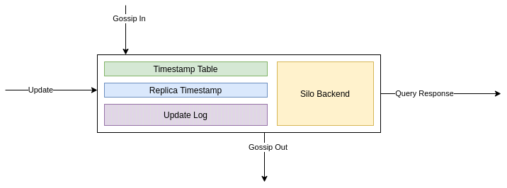

# Relatório do projeto Sauron

Sistemas Distribuídos 2019-2020, segundo semestre

## Autores

**Grupo T19**

| Número | Nome              | Utilizador                                    | Correio eletrónico                                                                      |
| ------ | ----------------- | --------------------------------------------- | --------------------------------------------------------------------------------------- |
| 90699  | Afonso Matos      | [afonsomatos](https://github.com/afonsomatos) | [afonsolfmatos@tecnico.ulisboa.pt](mailto:afonsolfmatos@tecnico.ulisboa.pt)                               |
| 90741  | João Tomás Lopes  | [tomlopes](https://github.com/tomlopes)       | [joaotomaslopes@tecnico.ulisboa.pt](mailto:joaotomaslopes@tecnico.ulisboa.pt)                         |
| 90775  | Ricardo Fernandes | [rickerp](https://github.com/rickerp)         | [ricardo.s.fernandes@tecnico.ulisboa.pt](mailto:ricardo.s.fernandes@tecnico.ulisboa.pt) |

  

## Melhorias da primeira parte

- [spot \* ordering by id](https://github.com/tecnico-distsys/T19-Sauron/commit/2f55891deda112f8bbbeb74b4f51093a24e17d21#diff-781a33c089feb1b4b74da871c8f53447L167-R170)
- [error handling (error mapping for gRPC)](https://github.com/tecnico-distsys/T19-Sauron/commit/282d6c1b22ea22548639189b3c583c04cf4c8f9b)

## Modelo de faltas

#### Faltas toleradas

- Quando uma réplica vai a baixo, enviando anteriormente uma mensagem gossip, evita que se percam os updates nela efetuados.
Visto que a réplica antes de cair conseguiu enviar mensagens gossip às restantes réplicas, conseguiu assim propagar a informação que os clientes submeteram.
- Estando um cliente conectado a uma réplica, após essa mesma réplica ir abaixo o cliente liga-se a outra réplica disponível (caso nenhuma réplica seja especificada no início da execução).
- Se especificado a réplica ao qual o cliente se liga, e essa mesma crashar e voltar a execução, o cliente reconecta-se à mesma (que entretanto pode ter mudado de endereço).
- Caso a réplica retorne uma resposta desatualizada a uma query, o cliente retorna uma resposta anterior guardada de modo a evitar possíveis incoerências. 
- Se a réplica crashar, ao voltar a execução, recupera todos os updates realizados anteriormente pelas restantes réplicas.

#### Faltas não toleradas

- Caso um servidor vá abaixo sem que propague os updates efetuados sobre ele através de gossip messages, toda esta informação é perdida visto que não foi propagada para os restantes os servidores. Esta falta não é tolerável visto que a réplica pode cair a qualquer altura sem qualquer aviso e sendo assim não é possível trocar mensagens gossip com os restantes servidores de modo a atualizar os restantes com as últimas atualizações realizadas pelos clientes

## Solução

As réplicas 1 e 2 estão a correr em simultâneo.
Existem dois clientes, X e Y.

1. O cliente X envia updates para a réplica 1.
   - O update A atualiza o timestamp da réplica para (1, 0).
   - O update B atualiza o timestamp da réplica para (2, 0).
2. A réplica 1 e 2 partilham _gossip messages_.
   - A réplica 1 partilha os updates A e B com a réplica 2, juntamente com o seu timestamp.
   - A réplica 2 não partilha nenhum update (porque a réplica 1 está atualizada), e envia o seu timestamp que agora
     está atualizado.
3. A réplica 2 falha silenciosamente, e volta a estar ativa - completamente desatualizada.
4. A réplica 1 não partilha nenhum update, porque o último timestamp da réplica 2 estava atualizado.
5. A réplica 2 volta a estar atualizada.
   - A réplica 2 não partilha nenhum update (porque não tem), e envia o seu timestamp desatualizado.
   - A réplica 1 nota o timestamp desatualizado da réplica 2 e envia os updates em falta.
6. O cliente Y faz um pedido à réplica 2.

   - A réplica 2 responde ao pedido com os updates inicias do cliente X.

Desta maneira, o cliente X e Y comunicaram através de um sistema distribuído!

## Protocolo de replicação

O protocolo usado é uma variação do  _gossip protocol_ (ver secção 18.4.1 do livro). 

Cada réplica possui várias estruturas:
* **Silo Backend** - O _Value_ como visto no _gossip protocol_. Esta estrutura é o objeto de todas as updates e queries.
Guarda observações e câmeras.
* **Update Log** - Uma lista com todos os updates aplicados no Silo Backend dentro desta réplica.
* **Replica Timestamp** - Igual ao _Value Timestamp_ do _gossip_. Um timestamp vetorial que reflete o estado atual do
_Silo Backend_.
* **Timestamp Table** - Uma tabela de timestamps vetoriais das réplicas restantes.
    

* Todas as réplicas, ao serem iniciadas, começam com a Replica Timestamp e o Timestamp Table a zero, e o Update Log vazio.

* **Ao receber um update dum cliente**, a réplica adiciona-a ao Update Log. Aplica o update ao Silo Backend imediatamente e
atualiza a Replica Timestamp incrementando a posição correspondente à réplica atual.

* **Para uma réplica A enviar um gossip para réplica B**, a réplica A preenche a mensagem de gossip com os Updates do Log
que podem estar em falta na réplica B. A réplica A sabe esta informação através do último timestamp vetorial conhecido
da réplica B, guardada no Timestamp Table.

* **Quando a réplica B recebe um gossip da réplica A**, a réplica B atualiza o timestamp vetorial da réplica A no
Timestamp Table com o recebido dentro da mensagem. Os Updates, também recebidos, são aplicados ao _Silo Backend_ e
adicionados ao Log, somente se não tiverem já sido executados. A réplica B atualiza o seu Replica Timestamp
para refletir os novos Updates.

* A cada **_x_** segundos (**_x_** configurável), cada réplica envia uma mensagem **gossip** para todas as outras réplicas encontradas
através do gestor de nomes.

## Opções de implementação

* O cliente contém uma **cache** de pedido-resposta guardado após cada query.
Quando o cliente recebe uma resposta mais antiga do que uma já obtida, retorna esta resposta anterior mais atualizada.
A cache tem um limite máximo de pedido-resposta que guarda. Segue uma política LRU para decidir quais os
pedido-resposta a discartar da cache quando ultrapassa um certo limite.
* O _Update Log_ típico do protocolo original sofre umas nuances. Os updates são aplicados imediatamente,
porque não existem dependências causais. O Log utilizado no nosso protocolo desempenha a função
de *guardar* os updates feitos para que possam ser partilhados com as outras réplicas.
É necessário guardar todos os updates porque não existe persistência de dados. Desta maneira,
asseguramos uma maneira de outras réplicas obterem todos os updates desde o início.

## Notas finais

Não há.
